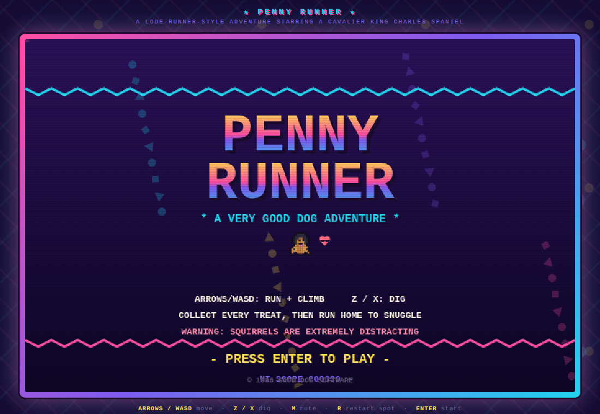
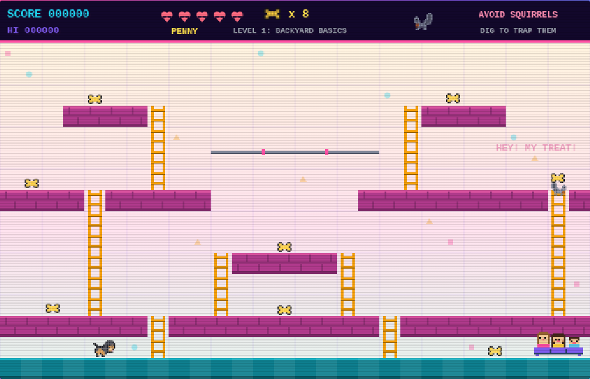

# ★ PENNY RUNNER ★

*A Lode-Runner-style arcade adventure starring Penny, a Cavalier King Charles
Spaniel who is a very good dog.*

Penny has one mission: eat every treat in the backyard, then get home for
snuggle time with her family. Standing between her and the couch: ladders,
monkey bars, diggable bricks, and the most dangerous force known to dog-kind —
**squirrels**.

## How to play

Open `index.html` in any modern browser. No build step, no dependencies.
(Or serve it: `npx http-server .` and visit the printed URL.)

| Key | Action |
| --- | --- |
| ← → / A D | Run |
| ↑ ↓ / W S | Climb ladders, drop from bars |
| **Z** / **X** | Dig a hole to the left / right |
| M | Mute |
| R | Send Penny back to her start spot (costs a heart) |
| Enter | Start |

## The rules of being a good dog

- **Treats** — collect every biscuit on the level. 100 points apiece.
- **Squirrels** — they roam the level chasing Penny and swipe unattended
  treats. **They are not friends: one touch costs Penny a life** (classic
  Lode Runner). Penny is faster than they are on open ground, so kite them —
  and the HUD flashes a warning when one gets close. Level 1's squirrel is
  slow, to ease you in. Penny gets a brief flash of invulnerability each time
  she (re)spawns.
- **Digging** — bricks (pink) can be dug through, Lode Runner style. Drop a
  squirrel into a hole to trap it (+75) — you can safely run across a trapped
  squirrel's head. Holes refill after a few seconds, so don't get caught in
  one yourself; that costs a heart too.
- **Snuggle time** — once the last treat is eaten the family calls from the
  couch. Get there for the snuggle bonus (faster = bigger) and the next level.

Three levels: **Backyard Basics**, **Squirrel Park**, and **The Big Dig**.
Finish all three to confirm what we already knew: Penny is a very good dog.

### Made to be kid-friendly (ages ~7–12)

- **No timer** — explore and plan at your own pace.
- **5 lives**, and a death only sends Penny back to the start of the *current*
  level with her collected treats kept — squirrels reset and she reappears with
  a second of invulnerability.
- **Running out of lives retries the same level** with fresh lives (you're
  never thrown back to Level 1), and your score carries over.
- **Penny is faster than every squirrel** (and Level 1's lone squirrel is
  extra slow), so you can always outrun them on open ground.
- Every level is provably completable with basic moving and climbing — no
  digging required — and no treat can be permanently stranded (see
  `tools/validate-levels.mjs`).

## Development

- Everything is hand-rolled in `game.js` — pixel-art sprites defined as
  character grids, WebAudio bleeps, and a tile-based movement/AI sim on a
  28×16 grid. `index.html` supplies the 90s Memphis-pattern wrapper.
- `node tools/validate-levels.mjs` checks every level map: dimensions, legal
  tiles, and a movement-graph BFS proving all treats and the family couch are
  reachable from Penny's spawn with no softlock spots (digging never
  required).

© 1996 GOOD DOG SOFTWARE (in spirit)
